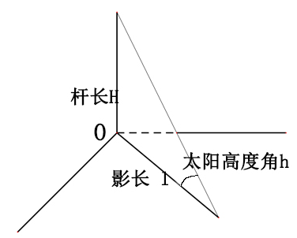
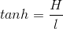
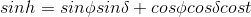
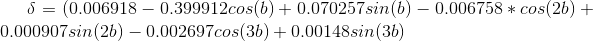
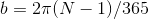
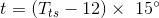
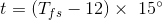
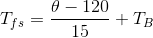
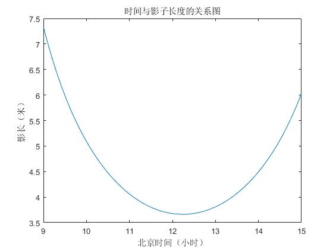
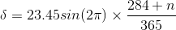

[TOC]

# 2015A全国大学生数学建模比赛解题思路

# 原题

百度网盘：[2015A](https://pan.baidu.com/s/1HmPXDGhNjPY8FnHE3CDQgg)

密码：nmwp

# 问题一

## 问题分析

本题计算直杆影子长度随时间的变化曲线，题目给出了经纬度，日期，杆长等固定参数，我们需要查阅文献找到影长与各个固定参数以及时间的关系，并根据该关系画出变化曲线。

## 模型假设

- 不考虑地球绕太阳的公转轨道是椭圆，即用平太阳时代替真太阳时

## 模型建立与求解

首先影长与杆长和太阳高度角的关系如下：

[comment]: $tan{h}=\frac{H}{l}$

即，故我们需要计算太阳高度角。查阅文献得太阳高度角得计算公式如下：

[comment]: $$sin{h}=sin{\phi}sin{\delta}+cos{\phi}cos{\delta}cos{t}​$$

其中$\delta$表示太阳赤纬，$\phi$表示地理纬度，t表示时角。故我们需要查找太阳赤纬和时角得计算公式，查阅文献得：

[comment]: $$\delta=(0.006918-0.399912cos{(b)}+0.070257sin{(b)}-0.006758*cos{(2b)}+0.000907sin{(2b)}-0.002697cos{(3b)}+0.00148sin{(3b})​$$

[comment]: $b=2\pi(N-1)/365$

其中，，平年n为1到365，闰年n为1到366。计算时角

[comment]: $$t=(T_{fs}-12)\times15°$$

在这里，我们忽略地球绕太阳轨道时椭圆的影响，用平太阳时代替真太阳时，即

[comment]: $$t=(T_{fs}-12)\times15°$$

平太阳时即当地的地方时，根据已知经度和北京时间，我们可以计算出平太阳时：

[comment]: $$T_{fs}=\frac{\theta-120}{15}+T_B$$

联立上述公式可以计算得影长与时间的曲线图，代码为calculate_h.m和question1.m。

结果如图所示：

# 问题二

## 问题分析

问题二，根据附件给出的数据（包括年、月、日、时间和影子坐标）计算直杆所在精度和纬度。由于第一问我们已经得到影长计算模型，所以我们根据该公式反推精度和纬度。未知变量是杆长、经度、纬度，我们可以考虑用最小二乘法遍历可能的数值，获得最有可能的经度和纬度的值。

## 模型假设

同第一问

## 模型建立与求解

首先将附件1中的影子坐标转换为影长，在设定遍历范围。考虑中国所在经度范围为东经73°到东经135°，纬度范围为北纬4°到53°。通过Matlab求解（question2.m）得到最优经纬度为：东经109.9°，北纬18.37°，此时杆长为1.96米。

# 附录

## 专业名词

太阳高度角：对于地球上的某个地点，太阳高度角是指太阳光的入射方向和地平面之间的夹角，专业上讲太阳高度角是指某地太阳光线与通过该地与地心相连的地表切面的夹角。太阳高度角简称高度角。当太阳高度角为90°时，此时太阳辐射强度最大；当太阳斜射地面时，太阳辐射强度就小。

赤纬角：又称太阳赤纬，是地球赤道平面与太阳与地球中心的连线之间的夹角。太阳赤纬（赤纬角）以年为周期，在+23 °26′与-23 °26′的范围内移动，成为季节的标志。

时角：一个天体的时角也可以表示该天体是否通过了当地的子午圈（中天）。时角的数值表示了该天体与当地子午圈的角距离，例如，一个天体的时角是2.5时，就表示它已经在2.5小时之前通过当地的子午圈，并且现在时刻在当地子午圈向西方向37.5°的角距离上。

北京时间并非北京（东经116.4°）的地方时间，而是东经120°的地方时间。

南北回归线：是太阳每年在地球上直射来回移动的分界线。南北回归线就是南纬和北纬纬度为23°26′的那条纬线(北回归线：23°26′N，南回归线23°26′S)。南回归线是太阳在南半球能够直射到的最远位置，大约在南纬23°26′，与纬度线平行。每年冬至日，太阳直射点在南半球的纬度达到最大，此时正是南半球的盛夏，此后太阳直射点逐渐北移，并始终在南纬23°26′附近和北纬23°26′附近的两个纬度圈之间周而复始地循环移动。因此，把这两个纬度圈分别称为北回归线和南回归线。

## 其他算法

查资料得多种赤纬角和真平太阳时时差的近似计算公式：

### Duffie算法

该算法引用Cooper在1969年提出的太阳赤纬角公式和Whiller在1979年提出的时差公式

[Cooper方程近似计算赤纬角公式]()：

[comment]: $$\delta = 23.45sin(2\pi)\times\frac{284+n}{365}$$

[Whillier近似计算时角公式]()：

[comment]: $$eot=9.87sin{2B}-7.53cos{B}-1.5sin{B}$$

其中$B=\frac{2\pi(n-81)}{364}$，n为该日期在一年中的日期序号。对于平年，则正常表示；对于闰年，则在三月份之前的天数加1，如1月1日为2，2月29日为61，其余日期，从3月1日开始为60，12月31日为365。

### Spencer算法

$$\delta=0.006918-0.399912cos{\Gamma}+0.070257sin{\Gamma}-0.006758cos{(2\Gamma)}+0.0009070sin{(2\Gamma)}-0.002697cos{(3\Gamma)}+0.001480sin{(3\Gamma)}$$

$$eot=(0.000075+0.001868cos{\Gamma}-0.032077sin{\Gamma}-0.014615cos{(2\Gamma)}-0.04089sin{(2\Gamma)})\times229.18$$

其中$\Gamma=\frac{2\pi(n-1)}{365}$表示日角，n为该日期在一年中的日期序列，平年为0到364，闰年为0到365。但Iqbal M提出一种无论平年还是闰年都为1到365，只是闰年2月29日和3月1日均为60的方法。

### Stine算法

该算法引用1968年Wloof提出的公式计算时差。

$$\delta=arcsin{0.39795cos{\frac{2\pi(n-173)}{365.242}}}$$

$$eot=0.258cos{x}-7.416sin{x}-3.648cos{(2x)}-9.228sin{(2x)}$$

其中，$x=\frac{360(n-1)}{365.42}$，n为该日期在一年中的日期序列，平年1到365，闰年1到366。

### Bourges算法与Lamm算法

Bourges算法计算赤纬角

$$\delta=0.3723+23.2567sin{(\omega t)}+0.1149sin{(2\omega t)}-0.1712sin{(3\omega t)}-0.7580cos{(\omega t)}+0.3656cos{(2\omega t)}+0.02010cos{(3\omega t)}$$

其中$\omega=\frac{2\pi}{365.2422}$，$t=n-1-n_0$，

$n_0=78.801+[0.2422(year-1969)]-INT[0.25(year-1969)]$

当n大于1969时，平年n为1到365，闰年n为1到366。

Lamm LO估计算时差方法

### 最精确的赤纬角估算方法

$$\delta=(0.006918-0.399912cos{(b)}+0.070257sin{(b)}-0.006758*cos{(2b)}+0.000907sin{(2b)}-0.002697cos{(3b)}+0.00148sin{(3b})$$

其中，$b=2\pi(N-1)/365$，平年n为1到365，闰年n为1到366。

### 时角计算公式

$$t=(T_{ts}-12)\times15°$$

在这里，我们忽略地球绕太阳轨道时椭圆的影响，用平太阳时代替真太阳时，即

$$t=(T_{fs}-12)\times15°$$

## 其他可以考虑但为实现的因素

### 真太阳时

实际上我们日常用的计时是平太阳时，平太阳时假设地球绕太阳是标准的圆形，一年中每天都是均匀的。北京时间是平太阳时，每天都是24小时。而如果考虑地球绕日运行的轨道是椭圆的，则地球相对于太阳的自转并不是均匀的，每天并不都是24小时，有时候少有时候多。考虑到该因素得到的是真太阳时。 

$$T_{ts}=T_{fs}+T_{c}$$

$T_{ts}$为真太阳时，$T_{fs}$为平太阳时，$T_{c}$为真平太阳时差

## 参考文献

1. 杜春旭, 王普, 马重芳,等. 日子数在太阳位置计算中的应用[J]. 太阳能学报, 2011, 32(11):1640-1645. 
2. 